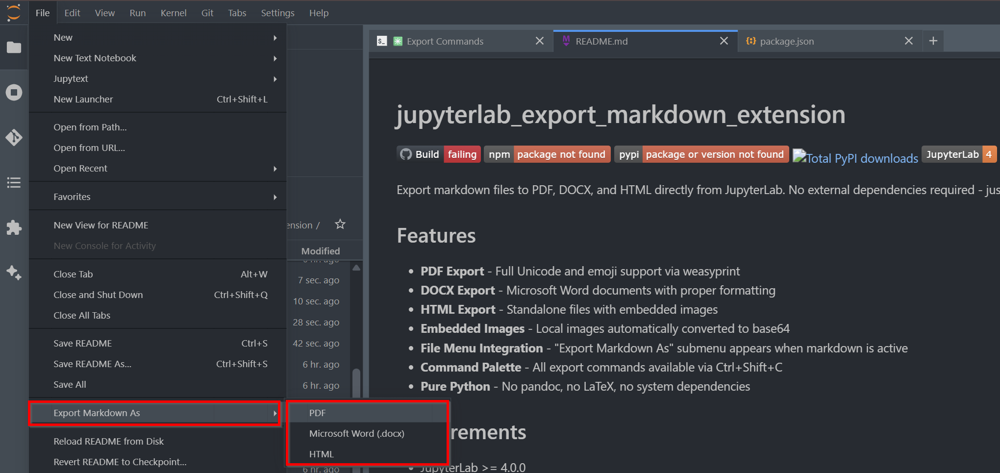

# jupyterlab_export_markdown_extension

[](https://github.com/stellarshenson/jupyterlab_export_markdown_extension/actions/workflows/build.yml)
[](https://www.npmjs.com/package/jupyterlab_export_markdown_extension)
[](https://pypi.org/project/jupyterlab-export-markdown-extension/)
[](https://pepy.tech/project/jupyterlab-export-markdown-extension)
[](https://jupyterlab.readthedocs.io/en/stable/)
[](https://kolomolo.com)

Export markdown files to PDF, DOCX, and HTML directly from JupyterLab. No external dependencies required - just `pip install` and go.



## Features

- **PDF Export** - Full Unicode and emoji support via weasyprint
- **DOCX Export** - Microsoft Word documents with smart image sizing (fit-to-page for large images)
- **HTML Export** - Standalone files with embedded images
- **Mermaid Diagrams** - Client-side rendering with calibrated DPI scaling (configurable, default 150 DPI)
- **Embedded Images** - Local images automatically converted to base64
- **Export Spinner** - Modal dialog shows progress during export operations
- **File Menu Integration** - "Export Markdown As" submenu appears when markdown is active
- **Command Palette** - All export commands available via Ctrl+Shift+C
- **Settings** - Configure diagram DPI via JupyterLab Settings Editor
- **Pure Python** - No pandoc, no LaTeX, no system dependencies

## Requirements

- JupyterLab >= 4.0.0
- Python >= 3.9

For PDF export, install required system libraries and emoji font:

```bash
# Ubuntu/Debian
sudo apt-get install libcairo2 libpango-1.0-0 libpangoft2-1.0-0 fonts-noto-color-emoji
```

Mermaid diagrams are rendered client-side using JupyterLab's built-in Mermaid support - no additional installation required.

## Install

```bash
pip install jupyterlab_export_markdown_extension
```

That's it. No really, that's actually it. We spent considerable effort making sure you don't have to install pandoc, LaTeX, or sacrifice a goat to get this working.

## Usage

1. Open a markdown file in JupyterLab
2. Use **File -> Export Markdown As** submenu, or
3. Open command palette (Ctrl+Shift+C) and search "Export Markdown"

## Export Formats

| Format | Library                | Notes                                           |
| ------ | ---------------------- | ----------------------------------------------- |
| PDF    | weasyprint             | Unicode, emojis, compact styling                |
| DOCX   | python-docx + htmldocx | Smart image sizing, banded tables, 0.5" margins |
| HTML   | markdown               | Standalone with embedded images                 |

## Settings

Configure the extension via **Settings -> Settings Editor -> Export Markdown Extension**:

- **Diagram DPI** - Resolution for Mermaid diagrams (default: 150, range: 72-600)

## Uninstall

```bash
pip uninstall jupyterlab_export_markdown_extension
```

## License

BSD 3-Clause License
