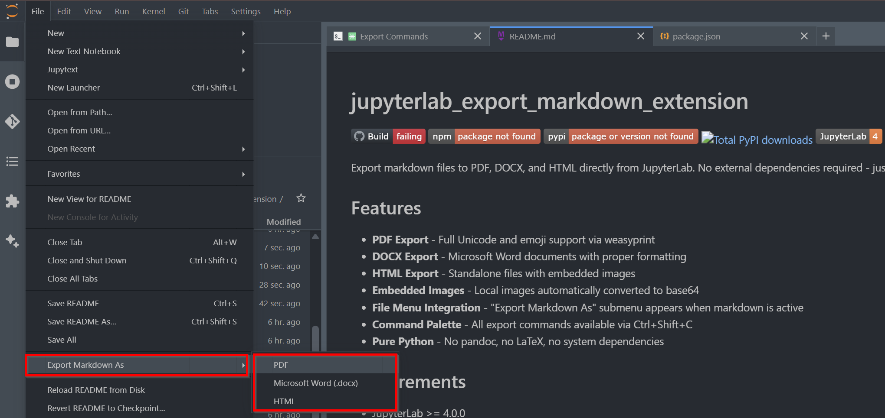

# jupyterlab_export_markdown_extension

[](https://github.com/stellarshenson/jupyterlab_export_markdown_extension/actions/workflows/build.yml)
[](https://www.npmjs.com/package/jupyterlab_export_markdown_extension)
[](https://pypi.org/project/jupyterlab-export-markdown-extension/)
[](https://pepy.tech/project/jupyterlab-export-markdown-extension)
[](https://jupyterlab.readthedocs.io/en/stable/)
[](https://kolomolo.com)

> [!TIP]
> This extension is part of the [stellars_jupyterlab_extensions](https://github.com/stellarshenson/stellars_jupyterlab_extensions) metapackage. Install all Stellars extensions at once: `pip install stellars_jupyterlab_extensions`

Export markdown files to PDF, DOCX, and HTML directly from JupyterLab. No external dependencies required - just `pip install` and go.



## Features

- **PDF Export** - Full Unicode and emoji support via reportlab
- **DOCX Export** - Microsoft Word documents with smart image sizing (fit-to-page for large images)
- **HTML Export** - Standalone files with embedded images
- **LaTeX Math** - Native OMML equations in DOCX (editable in Word), KaTeX in HTML, PNG images in PDF
- **GitHub Alerts** - Colored alert boxes for `[!NOTE]`, `[!TIP]`, `[!IMPORTANT]`, `[!WARNING]`, `[!CAUTION]` with left border and background shading in DOCX/PDF
- **Mermaid Diagrams** - Rendered server-side to PNG via Playwright Chromium at the configured SVG export width
- **Embedded Images** - Local images automatically converted to base64
- **Syntax Highlighting** - Code blocks with Pygments-powered coloring
- **Export Spinner** - Modal dialog shows progress during export operations
- **File Menu Integration** - "Export Markdown As" submenu appears when markdown is active
- **Command Palette** - All export commands available via Ctrl+Shift+C
- **Settings** - Configure SVG export width, math export width, and alert label visibility via Settings Editor
- **Pure Python** - No pandoc, no LaTeX, no system dependencies

## Requirements

- JupyterLab >= 4.0.0
- Python >= 3.10

For PDF export, install required system libraries and emoji font:

```bash
# Ubuntu/Debian
sudo apt-get install libcairo2 libpango-1.0-0 libpangoft2-1.0-0 fonts-noto-color-emoji
```

Mermaid diagrams are rendered client-side using JupyterLab's built-in Mermaid support - no additional installation required.

## Install

```bash
pip install jupyterlab_export_markdown_extension
```

That's it. No really, that's actually it. We spent considerable effort making sure you don't have to install pandoc, LaTeX, or sacrifice a goat to get this working.

## Usage

1. Open a markdown file in JupyterLab
2. Use **File -> Export Markdown As** submenu, or
3. Open command palette (Ctrl+Shift+C) and search "Export Markdown"

## Export Formats

| Format | Library                | Notes                                                            |
| ------ | ---------------------- | ---------------------------------------------------------------- |
| PDF    | reportlab              | Unicode support, compact styling, math as PNG images             |
| DOCX   | python-docx + htmldocx | Native OMML math, smart image sizing, banded tables, alert boxes |
| HTML   | markdown + KaTeX       | Standalone with embedded images, client-side math rendering      |

## Settings

Configure the extension via **Settings -> Settings Editor -> Markdown Export Extension**:

- **SVG Export Pixel Width** - Target pixel width for SVG images and Mermaid diagrams rasterized server-side in DOCX/PDF (default: 1920, range: 400-4096). Height follows the source aspect ratio
- **Math Export Pixel Width (PDF only)** - Target pixel width for math expression images in PDF export (default: 800, range: 200-3000). DOCX uses native OMML equations and HTML uses KaTeX, neither affected by this setting
- **Show Alert Labels** - Display alert type labels (NOTE, TIP, etc.) in exported documents (default: off)

## Uninstall

```bash
pip uninstall jupyterlab_export_markdown_extension
```

## License

BSD 3-Clause License
