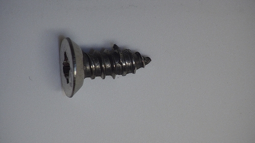
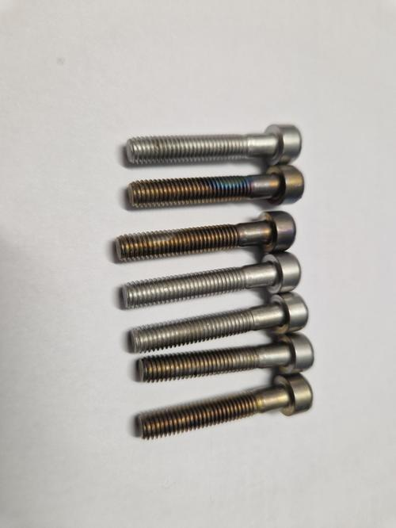
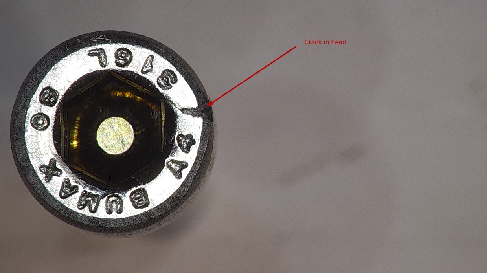
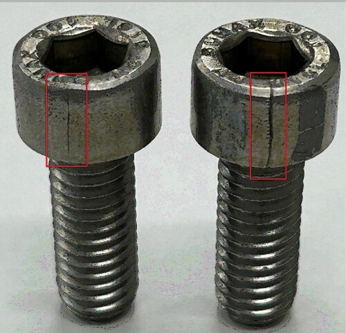
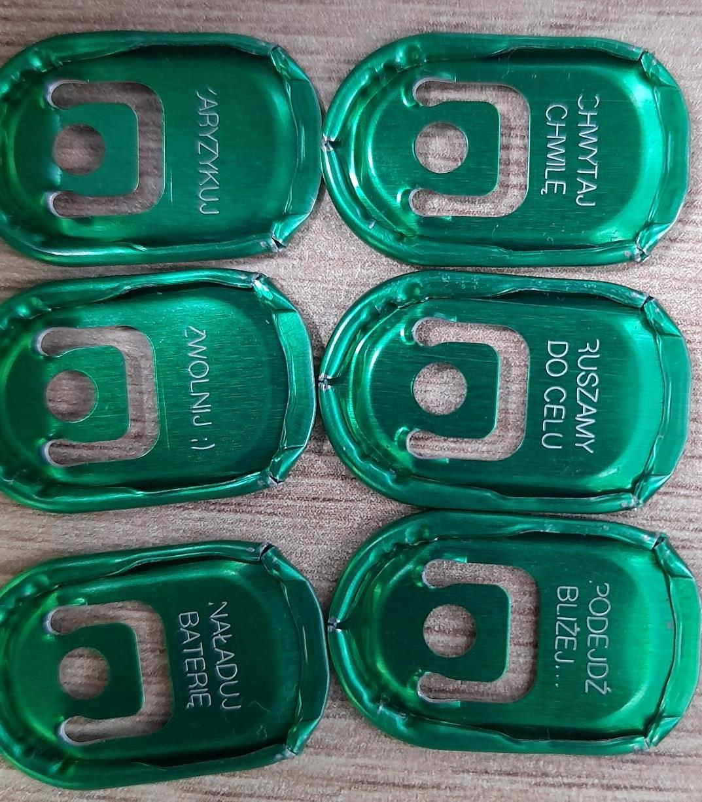

# Image Scaling Test

This document tests JPEG images with varying DPI metadata to verify consistent sizing in DOCX exports.

## Image 1 - screw_self_tapping.jpg (500x281, 1519 DPI)

Without DPI normalization, this image renders at 0.3x0.2 inches (tiny).

## Image 2 - defect_discoloration.jpg (500x666, 72 DPI)

Without DPI normalization, this image renders at 6.9x9.2 inches (overflows page height).

## Image 3 - defect_crack_head_top.jpeg (1239x695, 220 DPI)

Without DPI normalization, this image renders at 5.6x3.2 inches.

## Image 4 - defect_cracks_side.jpg (500x481, 96 DPI)

This image is already at 96 DPI - should render at 5.2x5.0 inches unchanged.

## Image 5 - batch_inspection_lids.jpeg (1073x1225, 96 DPI)

At 96 DPI renders at 11.2x12.8 inches - should be clamped to page bounds.

